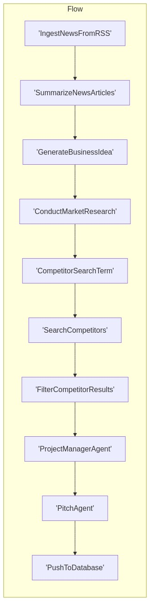

# News-to-Pitch Pipeline

An automated workflow that transforms news articles into business pitch ideas using a series of AI-powered processing nodes.



## Overview

This project uses the PocketFlow framework to create an agent-based pipeline that:

1. Ingests news articles from RSS feeds
2. Summarizes the articles
3. Generates business ideas based on the news
4. Conducts market research
5. Analyzes competitors
6. Estimates MVP timelines
7. Creates compelling business pitches
8. Saves the results to a database

## Features

- **Multi-source News Ingestion**: Collects news from various RSS feeds
- **AI-powered Analysis**: Uses LLM (GPT-4o) to process, analyze, and generate content
- **Competitor Research**: Automatically searches for and filters competitor information
- **Project Management**: Estimates MVP timelines with reasoning
- **Pitch Generation**: Creates compelling business pitches
- **Data Persistence**: Saves all generated ideas to a Supabase database
- **Visualization**: Generates a flow diagram of the entire pipeline

## Installation

1. Clone the repository:
   ```
   git clone https://github.com/yourusername/news-to-pitch.git
   cd news-to-pitch
   ```

2. Install dependencies:
   ```
   pip install -r requirements.txt
   ```

3. Set up environment variables:
   Create a `.env` file in the root directory with the following variables:
   ```
   OPENAI_API_KEY=your_openai_api_key
   SUPABASE_URL=your_supabase_url
   SUPABASE_SERVICE_KEY=your_supabase_service_key
   ```

## Dependencies

- PocketFlow
- OpenAI API
- Supabase
- feedparser
- duckduckgo-search
- PyYAML
- Pillow
- requests

## Usage

Run the main script to start the process:

```
python news/main.py
```

This will:
1. Create the workflow
2. Generate a visualization of the flow
3. Execute the pipeline
4. Print a summary of the results

## Pipeline Structure

The pipeline consists of the following nodes:

1. **IngestNewsFromRSS**: Collects news from RSS feeds
2. **SummarizeNewsArticles**: Condenses articles into concise summaries
3. **GenerateBusinessIdea**: Creates startup ideas based on news
4. **ConductMarketResearch**: Researches market potential
5. **CompetitorSearchTerm**: Generates search terms for competitors
6. **SearchCompetitors**: Searches for competitors online
7. **FilterCompetitorResults**: Extracts relevant competitor information
8. **ProjectManagerAgent**: Estimates MVP development timeline
9. **PitchAgent**: Creates compelling business pitches
10. **PushToDatabase**: Stores results in Supabase

## Customization

### Adding New RSS Feeds

Modify the `IngestNewsFromRSS.prep()` method in `nodes.py` to add or change RSS feed sources.

### Changing LLM Provider

The project currently uses OpenAI's GPT-4o. To use a different model, modify the `call_llm()` function in `utils/llm.py`.

### Extending the Pipeline

To add new processing steps:

1. Create a new class in `nodes.py` that inherits from `Node`
2. Implement the `prep()`, `exec()`, and `post()` methods
3. Update the flow in `flow.py` to include your new node

## Visualization

The flow diagram is automatically generated and saved as `news_flow_diagram.png` in the main directory. You can also view the Mermaid syntax in `flow_diagram.mmd`.

## Database Schema

The Supabase database table `startup_ideas` has the following schema:

- `title`: News article title
- `business_idea`: Generated business idea
- `mvp_estimate`: Estimated time to build MVP
- `developed_idea`: Market research and development
- `pitch`: Final pitch
- `source_url`: Original news article URL
- `published_at`: Article publication date
- `competitors`: Identified competitors

